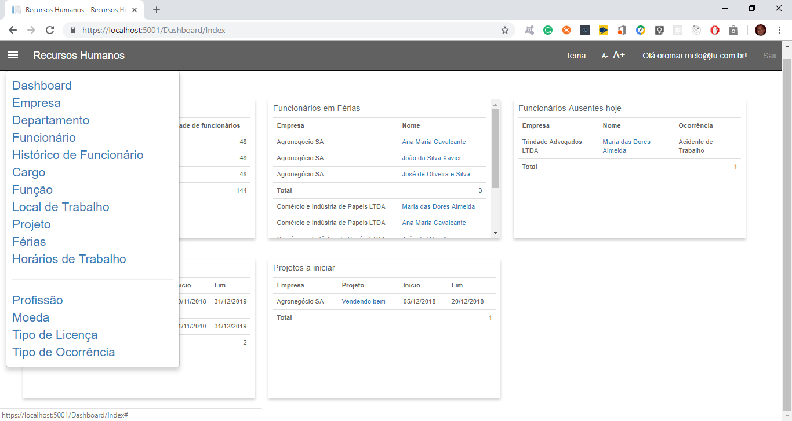
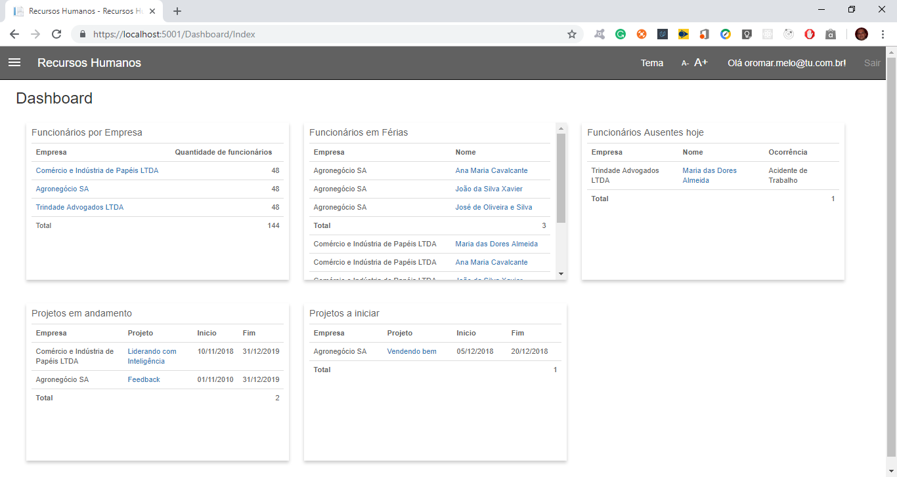
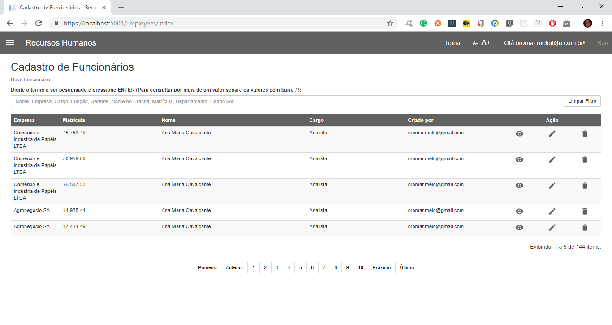
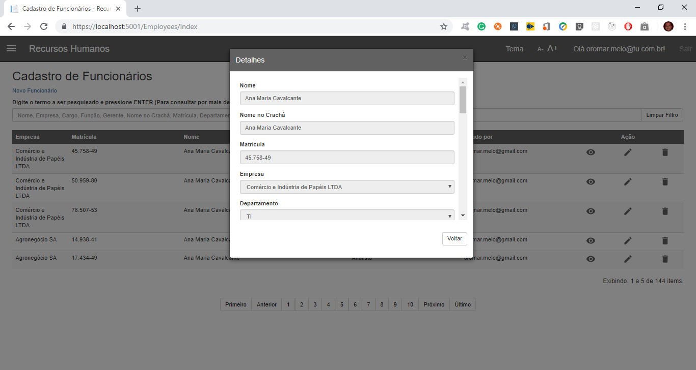
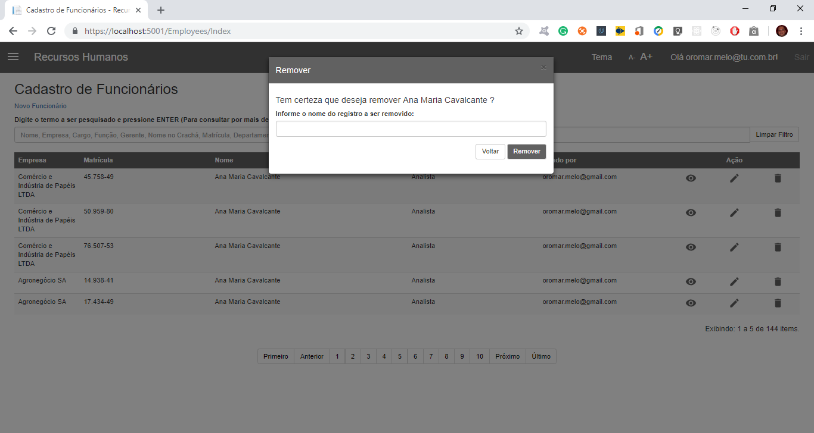
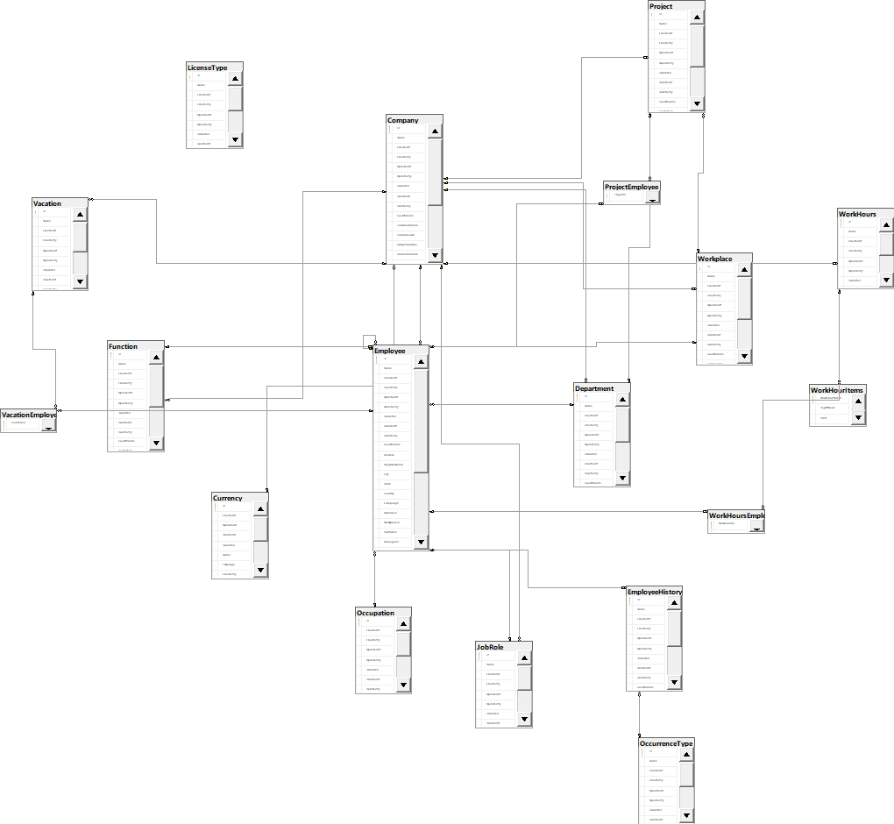

# Payroll

Este projeto foi desenvolvido para a obtenção de aprovação na disciplina de TCC na Universidade Estácio do Recife.

Consiste em uma aplicação web de gerenciamento de Recursos Humanos para uma empresa fictícia que oferece este serviço para outras empresas. Inclue cadastros diversos onde o usuário poderá criar, remover, alterar e consultar os dados de cada entidade da aplicação.

Tecnologias relacionadas:
<ul>
  <li> C# </li>
  <li> Asp.Net Core </li>
  <li> Sql Server </li>  
</ul>

Premissas levada em consideração no desenvolvimento:
<ul>
  <li> Desenvolvimento rápido de aplicações </li>
  <li> Reuso de código </li>
  <li> Abstrações </li>  
  <li> Aplicação centrado no usuário </li>  
</ul>

O projeto está desenvolvido com a arquitetura de 3 camadas (API, negócio e dados) com responsabilidades bem definidas para cada uma das camadas. Foi também desenvolvido levando em consideração o reuso de código afim de produzir menos código que faz mais trabalho.

A aplicação está internacionalizada para os seguintes idiomas: pt-BR, en-US, fr-FR. De acordo com o idioma o browser a aplicação irá aplicar o idioma correspondente, caso a aplicação não dê suporte ao idioma solicitado pelo browser continuará com o idioma atual, o padrão é pt-BR. 

Imagens da aplicação: 

Menu 
 - Menu com todas as opções disponíveis para o usuário
 
   

Dashboard 
 - Home da aplicação onde o usuário poderá ter acesso a informações rápidas sobre os funcionários gerenciados.
 
  

Telas de Listagens
  - O usuário poderá ter uma visão geral dos registros cadastrados bem como utilizar o filtro para pesquisar registros rapidamente
  
  
 
Telas de Edição
  - O usuário poderá criar novos registros como também editar registros
  
  

Telas de Detalhes
  - O usuário pode ter acesso a todas as informações de um único registro
  
  
  
Telas de exclusão
  - Para o usuário excluir determinado registro
  
  
  
Modelo de dados

  	
  
  Trabalhos futuros (para uma possível v2)
- Dashboard configurável pelo usuário (filtros, possibilidade de criar novos cards etc)
- Calcular folha de pagamento
- Escolher idioma diretamente na interface
- Suporte a novos idiomas (es-ES por exemplo)
- Adicionar auto-complete nos combos
